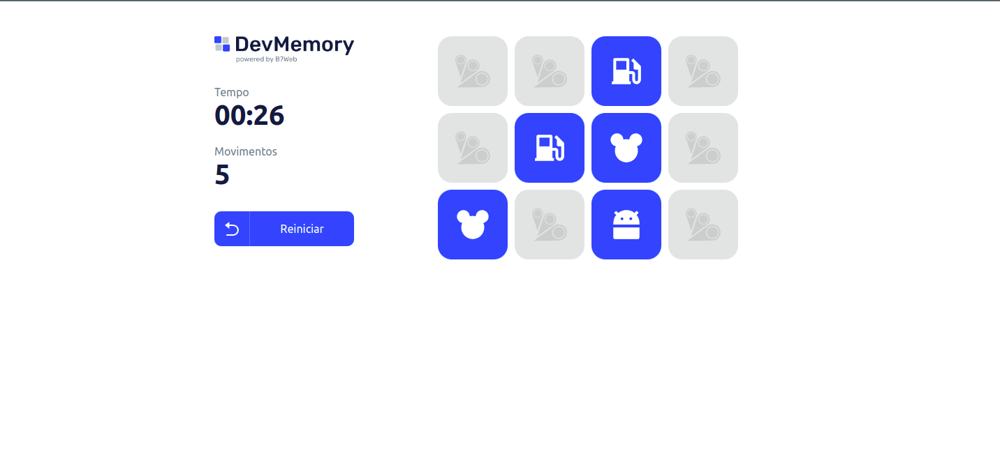

<h1 align='center'>
  
</h1>

## Sobre 📕

Projeto -  Jogo da memória
---

## Descrição 📕

Projeto realizado em React + Typescript, onde foi desenvolvido um jogo de memória que contém marcado de tempo e de movimentos, ao finalizar o tempo para automaticamente.

---

## Tecnologias 🚀

As tecnologias utilizadas foram:

-  [REACT](https://reactjs.org/)
-  [TYPESCRIPT](https://www.typescriptlang.org/)

---

## Instalação

---

No seu terminal, rode os comandos abaixo:

```bash
$ git clone https://github.com/luizsantos85/react-memory.git
$ cd react-app-imc
```

Instalar depêndencias e executar o frontend:

```bash
$ npm install
$ npm start
```

Made by [@luizsantos85](https://github.com/luizsantos85) 🚀

